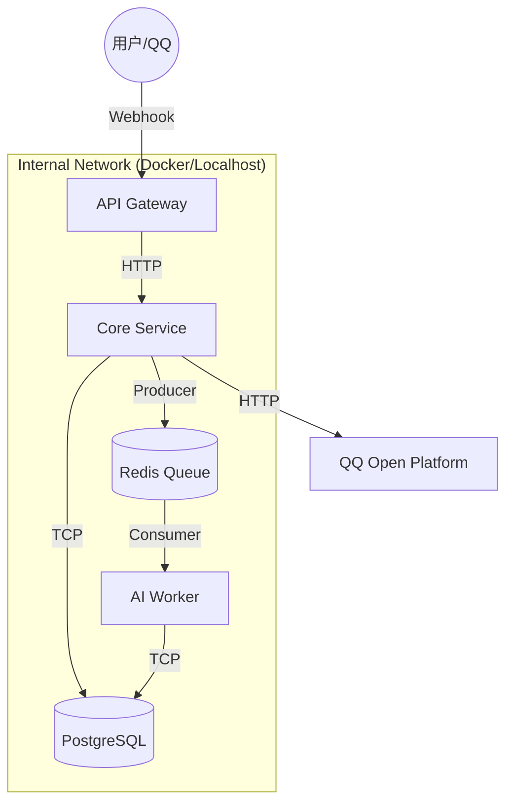

# 架构设计与原理说明书

**版本**: 1.1
**日期**: 2026-02-06

---

## 1. 系统架构总览

本系统采用 **NestJS Monorepo** 微服务架构，将系统拆分为“网关层”、“业务层”和“计算层”，以实现职责分离和弹性扩展。

### 1.1 顶层架构图



---

## 2. 模块详细说明

本章节详细列出工程中的所有模块及其具体职责，对应代码库中的 `apps/` 和 `libs/` 目录。

### 2.1 应用服务 (Apps)

这些是独立运行的进程，通过 `npm run start:dev <app-name>` 启动。

| 模块名称 | 目录路径 | 核心职责 | 关键技术点 |
| :--- | :--- | :--- | :--- |
| **API Gateway** | `apps/api-gateway` | **流量入口与安全防线**。<br>1. 接收 QQ 开放平台的 Webhook 回调。<br>2. **Ed25519 签名校验**：防止伪造请求。<br>3. 协议转换：将 QQ 的原始 JSON 转换为内部 DTO。<br>4. 简单的自动回复 (Echo) 逻辑（目前）。 | `NestJS Controller`, `@noble/ed25519`, `Raw Body Parsing` |
| **Core Service** | `apps/core-service` | **业务逻辑中心**。<br>1. **身份认证 (Auth)**：处理 `/bind` 绑定逻辑，生成 JWT。<br>2. **作业管理 (Homeworks)**：发布作业、接收提交。<br>3. **用户管理**：维护教师/学生档案。<br>4. 数据持久化：直接与 PostgreSQL 交互。 | `Passport`, `JWT`, `Prisma Client` |
| **AI Worker** | `apps/ai-worker` | **异步计算节点** (设计中)。<br>1. 监听 Redis 消息队列。<br>2. 消费作业提交任务。<br>3. 调用大模型 (LLM) API 进行评分。<br>4. 结果回写数据库。 | *BullMQ (Planned)*, *LLM API* |

### 2.2 共享类库 (Libs)

这些是代码库，不能独立运行，被上述 Apps 引用。

| 模块名称 | 目录路径 | 核心职责 | 关键技术点 |
| :--- | :--- | :--- | :--- |
| **QQ SDK** | `libs/qq-sdk` | **QQ 平台连接器**。<br>1. **类型定义**：`QQPayload`, `QQMessage` 等标准接口。<br>2. **API 客户端**：封装 `axios` 调用 QQ 发送消息接口。<br>3. **配置管理**：统一管理 AppID/Token。 | `HttpService`, `Interfaces` |
| **Database** | `libs/database` | **数据访问层 (DAL)**。<br>1. **Prisma Schema**：定义数据库表结构 (User, Homework, etc.)。<br>2. **Prisma Client**：生成强类型的数据库操作方法。<br>3. **DatabaseService**：单例数据库连接池。 | `Prisma ORM`, `PostgreSQL Adapter` |

---

## 3. 核心流程原理

### 3.1 消息接收与验签流程 (Security)

为了保证安全性，API Gateway 在接收到请求时会执行严格的校验：

1.  **拦截**: `ApiGatewayController` 拦截 `POST /webhook`。
2.  **提取**: 获取 HTTP Header 中的 `X-Signature-Ed25519` (签名) 和 `X-Signature-Timestamp` (时间戳)。
3.  **重组**: 将 `timestamp` 和 `rawBody` (原始请求体) 拼接。
4.  **验签**: 使用 `.env` 中的 `QQ_APP_SECRET` 派生出公钥，对拼接后的字符串进行 Ed25519 验证。
    *   *成功* -> 进入业务逻辑。
    *   *失败* -> 直接返回 403/401，拒绝处理。

### 3.2 身份绑定流程 (Business)

用户在 QQ 中输入 `/bind 张三 1001` 的处理链路：

1.  **解析**: 机器人收到消息，提取出指令 `/bind` 和参数。
2.  **调用**: 机器人（目前是 Gateway 模拟，未来是 Core Service）调用 `AuthService.bindUser()`。
3.  **存储**: 使用 `DatabaseService` 在 `users` 表中查找或创建记录。
    *   如果 `qq_openid` 已存在，更新姓名/学号。
    *   如果不存在，创建新记录。
4.  **反馈**: 调用 `QQService.sendMessage()` 回复“绑定成功”。

---

## 4. 数据库设计 (ER Diagram)

基于 `libs/database/prisma/schema.prisma` 的设计：

```mermaid
erDiagram
    User ||--o{ Submission : submits
    User ||--o{ Enrollment : joins
    Class ||--o{ Enrollment : has
    Class ||--o{ Homework : contains
    Homework ||--o{ Submission : has
    Submission ||--o| Grade : result

    User {
        string id PK
        string qq_openid UK "QQ唯一标识"
        string name
        string role "student/teacher"
    }

    Homework {
        string id PK
        string title
        datetime deadline
    }

    Submission {
        string id PK
        string content
        string file_url
    }
```

---

## 5. 扩展性设计

*   **微服务拆分**: 当前代码结构已按业务边界拆分 (Gateway vs Core)。未来如果业务增长，可以将 `Core Service` 进一步拆分为 `User Service` 和 `Homework Service`。
*   **队列削峰**: 引入 Redis 队列 (BullMQ) 后，即使 1000 人同时提交作业，AI Worker 也可以按设定的速率（如 5个/秒）稳定处理，不会压垮大模型接口。

