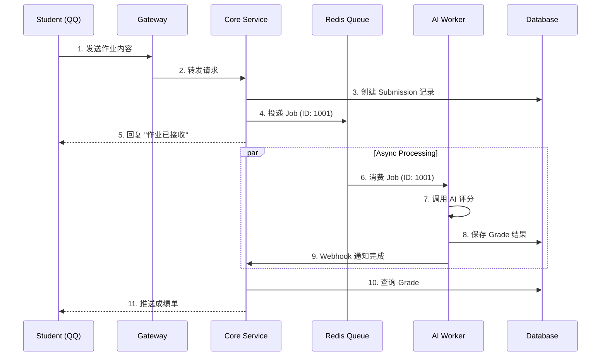

# 程序架构方案及原理说明书

**版本**: 1.0
**日期**: 2026-02-06

---

## 1. 架构总览

本系统采用 **微服务化分层架构**，旨在实现高内聚、低耦合，并重点优化了 AI 评分任务的异步处理能力。

### 1.1 系统上下文
系统作为 QQ 开放平台与最终用户之间的桥梁，通过 Webhook 接收 QQ 消息，处理业务逻辑后，通过 Open API 响应用户。

### 1.2 核心组件
*   **API Gateway**: 系统的统一入口，负责协议转换（QQ Protocol -> HTTP）、验签、限流。
*   **Core Service**: 包含所有同步业务逻辑（用户、班级、作业管理）。
*   **AI Worker**: 基于队列的异步消费者，负责耗时的 AI 推理任务。
*   **PostgreSQL**: 关系型数据持久化。
*   **Redis**: 缓存与消息队列存储。

---

## 2. 核心设计原理

### 2.1 异步解耦设计
**问题**: AI 评分通常需要 10-30 秒，如果同步等待会导致 HTTP 超时且阻塞 QQ 机器人响应。
**方案**: 引入 **Redis + BullMQ** 消息队列。
1.  用户提交作业 -> Core Service 写入 DB -> 生产 `score_job` -> 立即返回 "已接收"。
2.  AI Worker 消费 `score_job` -> 调用 LLM -> 更新 DB -> 触发回调。
3.  Core Service 收到回调 -> 主动推送 QQ 消息通知用户。

### 2.2 数据一致性保障
**原理**: 采用 **最终一致性** 模型。
*   作业提交状态分为 `pending` (处理中) -> `graded` (已评分)。
*   Worker 处理失败会触发 BullMQ 的 **指数退避重试** (Exponential Backoff)。
*   若多次重试失败，进入 Dead Letter Queue (死信队列) 等待人工干预。

### 2.3 安全架构
*   **传输层**: 全链路 HTTPS 加密。
*   **应用层**:
    *   **JWT 认证**: 所有内部 API 调用需携带 Token。
    *   **RBAC 鉴权**: 基于 NestJS Guard 实现的角色控制（Student 只能读自己，Teacher 读全班）。
*   **数据层**: 敏感字段（如 OAuth Token）加密存储。

---

## 3. 数据流转图 (Data Flow)

### 3.1 作业提交与评分流程

---

## 4. 技术栈选型理由

| 组件 | 选型 | 理由 |
| :--- | :--- | :--- |
| **Framework** | NestJS | 模块化设计、TypeScript 完美支持、生态丰富（特别是 Microservices 模块）。 |
| **Language** | TypeScript | 类型安全，减少运行时错误，适合多人协作。 |
| **ORM** | Prisma | Schema-first 设计，自动生成强类型 Client，开发体验优于 TypeORM。 |
| **Queue** | BullMQ | 基于 Redis 的高性能队列，支持延迟、重试、优先级，功能成熟。 |
| **Database** | PostgreSQL | 强大的 JSONB 支持（存储 AI 原始响应），事务安全性高。 |

---

## 5. 扩展性设计

### 5.1 横向扩展 (Scale Out)
*   **无状态服务**: API Gateway 和 Core Service 均为无状态，可随时增加容器实例。
*   **Worker 扩展**: 当评分任务积压时，可独立增加 AI Worker 容器数量，并行消费队列。

### 5.2 模块化
*   采用 Monorepo 结构，未来可将 `file-service` 或 `notification-service` 拆分为独立微服务，只需在 `libs/` 中抽离共享逻辑即可。
