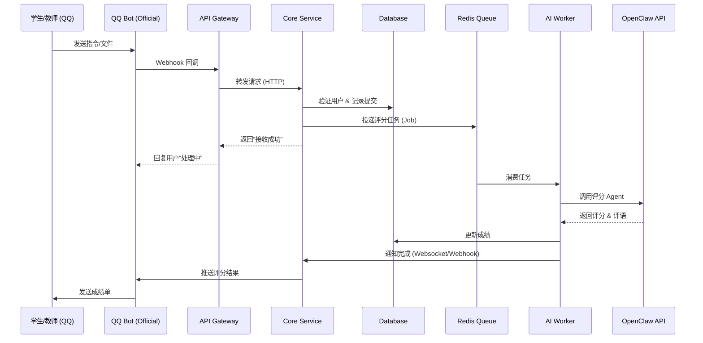

# 教学作业管理平台工程规划方案

## 1. 项目概述

### 1.1 项目目标

构建一个基于 QQ 官方机器人入口的教学作业管理平台，实现：

* 作业发布与截止管理
* 学生作业提交
* AI 自动评价
* 教师人工复核
* 成绩统计与导出
* 提交进度追踪

目标规模：

* 初期支持 100–300 名学生
* 可扩展至 1000+ 用户

该系统定位为：

> 轻量级 AI 教学管理平台（LMS 核心子系统）

---

### 1.2 非目标范围

本阶段不包含：

* 视频教学系统
* 直播课堂
* 商业支付
* 移动 App 原生客户端
* 复杂课程体系

重点聚焦：

> 作业 → 提交 → 评分 → 管理

---

## 2. 总体系统架构

### 2. 总体系统架构

### 2.1 核心流程时序 (Sequence Diagram)



### 2.2 架构分层与通信

*   **接入层 (Gateway)**: 处理 QQ 机器人 Webhook 验签、限流、静态资源托管。
*   **业务层 (Core Service)**: 处理作业逻辑、用户权限、班级管理。采用 RESTful API。
*   **计算层 (AI Worker)**: 独立进程，通过 Redis 队列解耦，负责调用大模型进行耗时评分。
*   **存储层 (Data Layer)**: PostgreSQL 存储关系数据，Redis 存储会话与队列，S3 存储作业文件。

### 2.3 服务拆分

```
gateway-service       # QQ 入口网关
edu-service           # 教学业务逻辑
ai-worker             # AI 评分服务
file-service          # 文件上传与存储
frontend-admin        # 教师后台
frontend-student      # 学生提交端
```

每个服务以容器形式独立部署。

---

## 3. 功能模块设计

### 3.1 用户与权限模块

功能：

* QQ 身份绑定
* 学生名单导入
* 班级管理
* 权限控制

角色模型：

```
Admin
Teacher
Student
```

权限原则：

* 所有 API 必须进行 RBAC 权限校验
* 教师仅能访问所属班级数据

---

### 3.2 作业管理模块

支持功能：

* 发布作业
* 编辑与撤回
* 截止时间设置
* 多附件要求
* 重交策略

作业状态流：

```
Draft → Published → Closed → Archived
```

---

### 3.3 提交管理模块

功能：

* 文本提交
* 文件提交
* 多版本记录
* 截止锁定

规则：

* 学生允许多次提交
* 系统保留历史版本

---

### 3.4 AI 评分模块

处理流程：

```
学生提交
→ 写入队列
→ AI Worker 处理
→ OpenClaw 评分
→ 写入数据库
```

特性：

* 异步处理
* 自动重试
* 支持人工覆盖评分

评分字段：

```
score
feedback
confidence
teacher_override
```

---

### 3.5 通知模块

通知渠道：

* QQ 群通知
* 私聊提醒
* Web 通知

触发事件：

* 新作业发布
* 截止提醒
* 评分完成
* 未提交提醒

---

### 3.6 统计与分析模块

教师可查看：

* 提交率
* 平均成绩
* 分数分布
* 迟交名单
* 学生趋势

支持：

* CSV 导出
* Excel 导出

---

### 3.7 API 接口设计 (Core API)

采用 RESTful 风格，所有接口需携带 `Authorization: Bearer <token>`。

#### A. 认证 (Auth)
*   `POST /auth/qq-login`
    *   Body: `{ code: string }`
    *   Res: `{ accessToken: string, user: User }`

#### B. 作业管理 (Teacher)
*   `POST /homeworks` - 发布作业
*   `PATCH /homeworks/:id` - 修改作业
*   `GET /homeworks?classId=xxx` - 列表查询
*   `GET /homeworks/:id/stats` - 获取统计数据

#### C. 提交与评分 (Student/System)
*   `POST /submissions` - 提交作业
    *   Body: `{ homeworkId: uuid, content: string, files: url[] }`
*   `GET /submissions/my?homeworkId=xxx` - 查看我的提交
*   `GET /submissions/:id/grade` - 查看评分结果

#### D. Webhook (Internal)
*   `POST /webhook/qq-bot` - 接收 QQ 机器人消息
*   `POST /webhook/ai-callback` - 接收 AI 评分完成通知

---

## 4. 数据架构设计

### 4.1 核心数据模型 (ER Design)

使用 PostgreSQL，关键表结构定义如下：

#### A. 用户与班级 (Identity)
*   **users**:
    *   `id` (UUID, PK)
    *   `qq_openid` (VARCHAR, Index, Unique) - QQ 唯一标识
    *   `role` (ENUM: 'student', 'teacher', 'admin')
    *   `name` (VARCHAR) - 真实姓名
    *   `created_at` (TIMESTAMP)

*   **classes**:
    *   `id` (UUID, PK)
    *   `name` (VARCHAR)
    *   `teacher_id` (UUID, FK -> users.id)
    *   `join_code` (VARCHAR, Unique) - 班级邀请码

*   **enrollments**:
    *   `user_id` (UUID, FK)
    *   `class_id` (UUID, FK)
    *   `joined_at` (TIMESTAMP)
    *   *(Composite PK: user_id + class_id)*

#### B. 作业与提交 (Homework)
*   **homeworks**:
    *   `id` (UUID, PK)
    *   `class_id` (UUID, FK)
    *   `title` (VARCHAR)
    *   `description` (TEXT)
    *   `deadline` (TIMESTAMP)
    *   `requirements` (JSONB) - 评分标准/文件格式要求
    *   `status` (ENUM: 'draft', 'published', 'closed')

*   **submissions**:
    *   `id` (UUID, PK)
    *   `homework_id` (UUID, FK)
    *   `student_id` (UUID, FK)
    *   `content_text` (TEXT)
    *   `file_urls` (ARRAY<VARCHAR>)
    *   `version` (INT)
    *   `submitted_at` (TIMESTAMP)

#### C. 评价与反馈 (Assessment)
*   **grades**:
    *   `submission_id` (UUID, FK, Unique)
    *   `score` (DECIMAL)
    *   `feedback` (TEXT) - AI 评语
    *   `ai_raw_response` (JSONB) - 原始 AI 返回
    *   `is_override` (BOOLEAN) - 是否被教师人工修改
    *   `graded_at` (TIMESTAMP)

*   **ai_jobs**:
    *   `id` (UUID, PK)
    *   `submission_id` (UUID, FK)
    *   `status` (ENUM: 'pending', 'processing', 'completed', 'failed')
    *   `retry_count` (INT)
    *   `error_log` (TEXT)

原则：

*   软删除 (deleted_at)
*   审计日志 (Audit Log)
*   数据可追溯

---

### 4.2 文件存储

使用对象存储：

* AWS S3
* 阿里 OSS
* Cloudflare R2

路径结构：

```
/class/{id}/hw/{id}/student/{id}/file
```

数据库仅保存 URL。

---

### 4.3 队列系统

```
Redis + BullMQ
```

队列类型：

* ai_scoring_queue
* notification_queue

---

## 5. 技术选型与工程结构

### 5.1 Monorepo 工程结构

使用 TurboRepo 或 Nest CLI Workspaces 管理多服务：

```text
/
├── apps/
│   ├── api-gateway/      # 统一入口 (NestJS)
│   ├── core-service/     # 核心业务 (NestJS)
│   ├── ai-worker/        # 评分消费者 (NestJS Standalone)
│   └── web-admin/        # 教师管理后台 (Next.js)
├── libs/
│   ├── common/           # 共享 DTO, Utils
│   ├── database/         # Prisma Schema & Client
│   └── queue/            # BullMQ 配置与 Job 定义
├── docker/               # 部署配置
└── package.json
```

### 5.2 关键技术栈

*   **Runtime**: Node.js v18+ (LTS)
*   **Framework**: NestJS v10 (Backend), Next.js 14 (Frontend)
*   **Database ORM**: Prisma (Type-safe, Schema-first)
*   **Queue**: BullMQ (基于 Redis 的稳健队列)
*   **Auth**: Passport-jwt + QQ OAuth 2.0
*   **Validation**: Zod / class-validator
*   **Documentation**: Swagger / OpenAPI (自动生成)

### 5.3 基础设施

后端：

```
NestJS
PostgreSQL
Redis
BullMQ
Docker
```

前端：

```
React / Next.js
TailwindCSS
```

认证：

```
JWT + QQ OAuth
```

AI 接口：

```
OpenClaw Agent API
```

---

## 6. 开发阶段规划

### 阶段 1：MVP (Core Loop) - 预计 2 周

**Goal**: 完成 "发布 -> 提交 -> 评分 -> 反馈" 闭环。

#### Week 1: 基础架构与核心业务
1.  **工程初始化**: 搭建 NestJS Monorepo，配置 Prisma + Postgres + Docker Compose。
2.  **数据层实现**: 定义 `schema.prisma`，完成 Migration，封装 DAO。
3.  **认证模块**: 实现 JWT Strategy，集成 QQ OAuth 登录接口。
4.  **作业模块**: 实现 `Homework` CRUD，支持发布作业 (Draft/Publish)。

#### Week 2: 提交与 AI 评分
1.  **提交模块**: 实现 `Submission` 接口，支持文本/链接存储。
2.  **队列集成**: 配置 BullMQ，实现 `Producer` (提交时) 和 `Consumer` (Worker)。
3.  **AI Worker**: 编写 Worker 逻辑，调用 OpenClaw API 获取评分，回写数据库。
4.  **联调测试**: 使用 Postman 跑通全流程。

### 阶段 2：教学版（4–6 周）

新增：

* 多班级
* 通知系统
* 文件上传
* 教师后台 UI

交付：

> 可正式教学使用

---

### 阶段 3：平台版（8 周+）

新增：

* 数据统计
* 权限系统
* 审计日志
* 自动备份
* 性能优化

交付：

> 稳定平台级系统

---

## 7. 部署方案

生产部署结构：

```
Nginx
API Service
Worker Service
PostgreSQL
Redis
Object Storage
OpenClaw
```

管理方式：

```
Docker Compose
```

备份策略：

* 每日数据库备份
* 文件冗余存储

---

## 8. 性能预估

100 人规模：

* 并发提交 < 10
* AI 后台处理
* 单机 2C4G 足够

扩展方式：

```
横向增加 AI worker
```

---

## 9. 安全与合规

关键要求：

* 学生隐私保护
* 权限隔离
* 操作审计
* API 限流
* 数据加密

教育数据视为敏感数据处理。

---

## 10. 风险评估

技术风险：

* QQ API 限制
* AI 评分误判
* 文件上传失败

运营风险：

* 作业丢失
* 权限误操作

对策：

* 自动备份
* 手动复核
* 日志审计

---

## 11. 长期扩展方向

未来可扩展为：

* 在线考试系统
* AI 教学助手
* 学习数据分析
* 移动端 App
* 家长端

定位：

> AI 驱动的教育平台核心系统

---

如果你愿意，下一步可以进入真正工程阶段：

👉 写 API 设计文档
👉 设计数据库 schema
👉 搭 NestJS 项目骨架
👉 写 Docker Compose
👉 写 AI worker
👉 搭教师后台框架

告诉我下一步优先做哪块。
